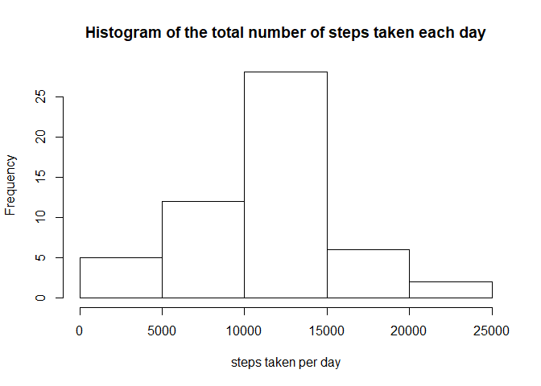
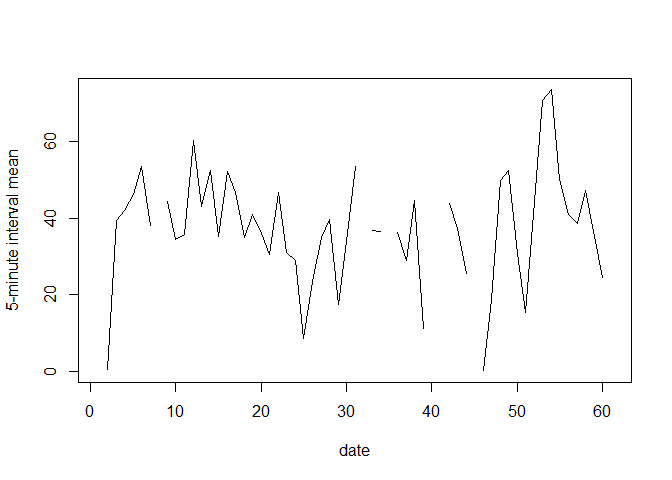
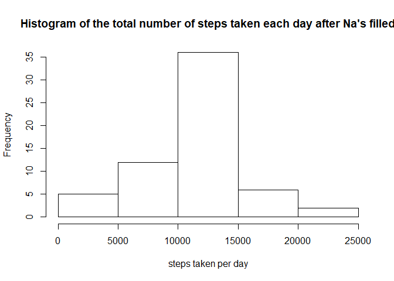
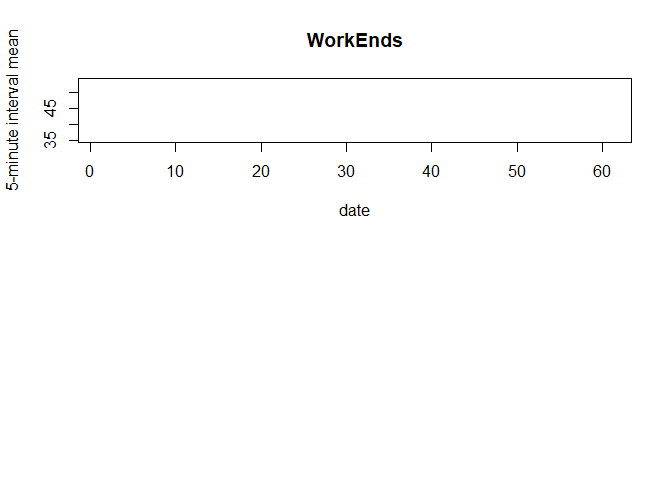

## Loading and preprocessing the data


```r
if(!file.exists("activity.csv")){
      unzip("activity.zip")
}
activity <- read.csv("activity.csv")
```

## What is mean total number of steps taken per day?


```r
hist(tapply(activity$steps, activity$date, sum), xlab = "steps taken per day", main = "Histogram of the total number of steps taken each day")
```

<!-- -->

```r
actMean <- mean(tapply(activity$steps, activity$date, sum), na.rm = TRUE)
print(actMean)
```

```
## [1] 10766.19
```

```r
actMedi <- median(tapply(activity$steps, activity$date, sum), na.rm = TRUE)
print(actMedi)
```

```
## [1] 10765
```


## What is the average daily activity pattern?

```r
avgDaily <- tapply(activity$steps, activity$date, mean)
plot(avgDaily, type = "l", xlab = "date",  ylab = "5-minute interval mean")
```

<!-- -->


## Imputing missing values

```r
naNum <- length(activity$steps[is.na(activity$steps)])
```
The total number of Na values is 2304.

Now, use the mean of the total '5-minute interval' to fill the Na's and make a histogram of the total number of steps taken each day 


```r
avgOfAll <- mean(activity$steps, na.rm = TRUE)
activity[is.na(activity$steps), 'steps'] = avgOfAll

hist(tapply(activity$steps, activity$date, sum), xlab = "steps taken per day", main = "Histogram of the total number of steps taken each day after Na's filled")
```

<!-- -->

```r
actMeanNONa <- mean(tapply(activity$steps, activity$date, sum), na.rm = TRUE)
print(actMeanNONa)
```

```
## [1] 10766.19
```

```r
actMediNoNa <- median(tapply(activity$steps, activity$date, sum), na.rm = TRUE)
print(actMeanNONa)
```

```
## [1] 10766.19
```


## Are there differences in activity patterns between weekdays and weekends?

```r
activity$weekday <- as.factor(weekdays(as.Date(as.character(activity$date))))

weekDaysActivity <- subset(activity, !activity$weekday %in% c("星期六", "星期天"))
weekEndsActivity <- subset(activity, activity$weekday %in% c("星期六", "星期天"))

par(mfrow = c(2, 1))

avgWeekDays <- tapply(weekDaysActivity$steps, weekDaysActivity$date, mean)
#plot(avgWeekDays, type = "l", xlab = "date",  ylab = "5-minute interval mean", main = "WorkDays")

avgWeekEnds <- tapply(weekEndsActivity$steps, weekEndsActivity$date, mean)
plot(avgWeekEnds, type = "l", xlab = "date",  ylab = "5-minute interval mean", main = "WorkEnds")
```

<!-- -->

